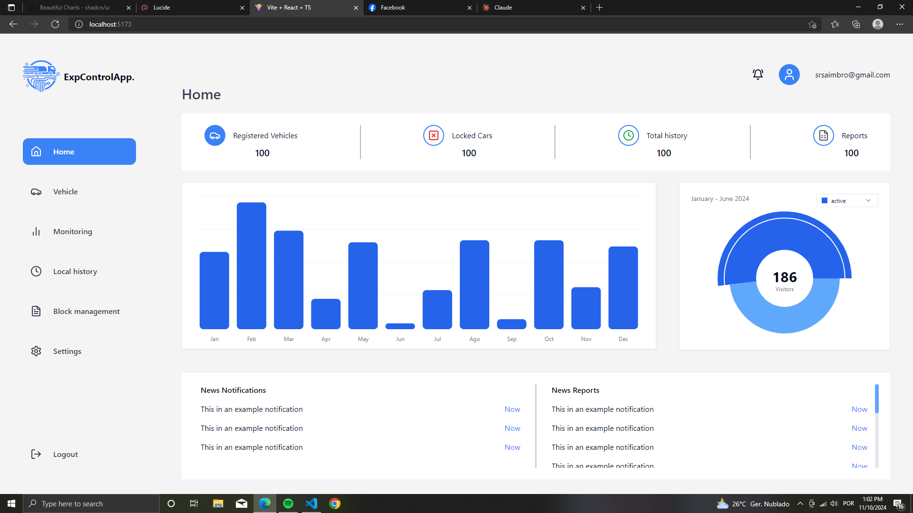

# Vehicle Control



> vehicle control é um dashboard para monitoral o funcionamento de cada veicul9o que faz parte da nossa empresa

### Ajustes e melhorias

O projeto ainda está em desenvolvimento e as próximas atualizações serão voltadas para as seguintes tarefas:

- [x] criação do layout
- [ ] validações
- [ ] consumo da api
- [ ] criação do layout responsivo

## 💻 Pré-requisitos

Antes de começar, verifique se você atendeu aos seguintes requisitos:

- Você instalou a versão mais recente de `<nodejs>`

## 🚀 Instalando <Vehicle-control>

Para instalar o <Vehicle control>, siga estas etapas:

Linux e macOS:

```
git clone a url do projecto
```

Windows:

```
git clone a url do projecto
```

## ☕ Usando < Vehicle_Control>

Para usar <Vehicle_Control>, siga estas etapas:

```
git clone o projecto
```

```
npm install
```

```
npm run dev
```

## 📫 Contribuindo para <Vehicle_Control>

Para contribuir com <Vehicle_Control>, siga estas etapas:

1. Bifurque este repositório.
2. Crie um branch: `git checkout -b <nome_branch>`.
3. Faça suas alterações e confirme-as: `git commit -m '<mensagem_commit>'`
4. Envie para o branch original: `git push origin <Vehicle_Control> / <local>`
5. Crie a solicitação de pull.

Como alternativa, consulte a documentação do GitHub em [como criar uma solicitação pull](https://help.github.com/en/github/collaborating-with-issues-and-pull-requests/creating-a-pull-request).

## 🤝 Colaboradores

Agradecemos às seguintes pessoas que contribuíram para este projeto:

<table>
  <tr>
    <td align="center">
      <a href="#" title="colaboradoes">
        <br>
        <sub>
          <b>Teixeira Manuel</b>
        </sub>
      </a>
    </td>
    <td align="center">
      <a href="#" title="Colaboradores">
        <br>
        <sub>
          <b>Orlando Martinho</b>
        </sub>
      </a>
    </td>
  </tr>
</table>

## 😄 Seja um dos contribuidores

Quer fazer parte desse projeto? Clique [AQUI](CONTRIBUTING.md) e leia como contribuir.

## 📝 Licença
